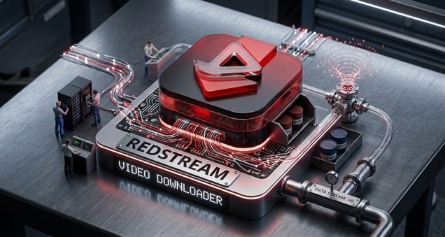
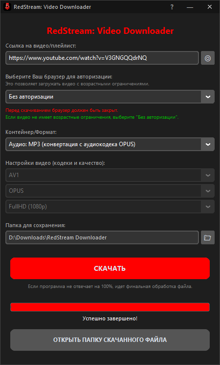

# RedStream: Video Downloader

## 📥 Простой и удобный загрузчик видео с популярных сайтов

**RedStream** — десктопное приложение для Windows с минималистичным интерфейсом, позволяющее скачивать видео и аудио с YouTube, Instagram, TikTok и сотен других платформ. Построено на базе [yt-dlp](https://github.com/yt-dlp/yt-dlp), [ffmpeg](https://github.com/ffmpeg/ffmpeg), [CustomTkinter](https://github.com/TomSchimansky/CustomTkinter) и [Pillow](https://github.com/python-pillow/Pillow).

---

## ✨ Возможности:
- Поддержка YouTube, Instagram, TikTok и [многих других сайтов](https://github.com/yt-dlp/yt-dlp/blob/master/supportedsites.md)
- Скачивание видео в форматах **MKV** и **MP4**
- Скачивание аудио в форматах **OPUS**, **M4A**, **MP3**
- Выбор разрешения: от SD (480p) до 8K (4320p)
- Выбор видеокодека: **AV1**, **VP9**, **H.264**
- Выбор аудиокодека: **OPUS**, **AAC**
- Авторизация через браузер для видео с возрастными ограничениями
- Прогресс-бар с отображением скорости и размера загрузки
- Кастомный заголовок окна и сплэш-экран при запуске

---

## ⚙️ Установка:

### Вариант 1 — готовый `.exe` (рекомендуется):
1. Скачать последний релиз из раздела [Releases](https://github.com/frostbittenbull/RedStream/releases)
2. Запустить `RedStream.exe`

### Вариант 2 — из исходников:
```bash
git clone https://github.com/frostbittenbull/RedStream.git
cd RedStream
curl -L https://github.com/yt-dlp/yt-dlp/releases/latest/download/yt-dlp.exe -o yt-dlp.exe
curl -L https://github.com/BtbN/FFmpeg-Builds/releases/latest/download/ffmpeg-master-latest-win64-gpl.zip -o ffmpeg.zip
tar -xf ffmpeg.zip
for /d %i in (ffmpeg-*-git-*) do move /y "%i\bin\ffmpeg.exe" .
for /d %i in (ffmpeg-*-git-*) do rmdir /s /q "%i"
del ffmpeg.zip
pip install -r requirements.txt
python main.py
```

> **Зависимости:** `customtkinter`, `Pillow`  
> **Требуется:** `yt-dlp.exe` и `ffmpeg.exe` в папке с приложением (или в `PATH`)

---

## 🖼️ Скриншот:


---

## 📁 Куда сохраняются файлы:
Все загруженные файлы сохраняются в папку `RedStream Downloader` на рабочем столе.

---

## 🔐 Авторизация через браузер:
Для скачивания видео с возрастными ограничениями выберите ваш браузер в выпадающем списке.

⚠️ **Перед скачиванием браузер должен быть закрыт.**

Если видео не имеет ограничений — выберите «Без авторизации».

---

## 🛠️ Стек технологий:
- Python 3.x
- [yt-dlp](https://github.com/yt-dlp/yt-dlp)
- [ffmpeg](https://github.com/ffmpeg/ffmpeg)
- [7zipExtra] (https://github.com/ip7z/7zip)
- [upx] (https://github.com/upx/upx)
- [CustomTkinter](https://github.com/TomSchimansky/CustomTkinter)
- [Pillow](https://github.com/python-pillow/Pillow)
