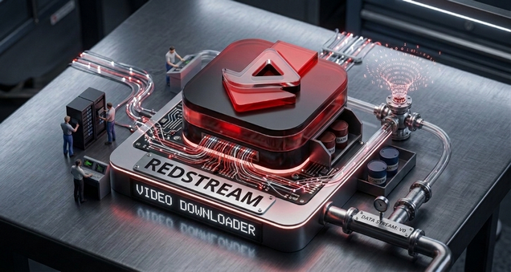
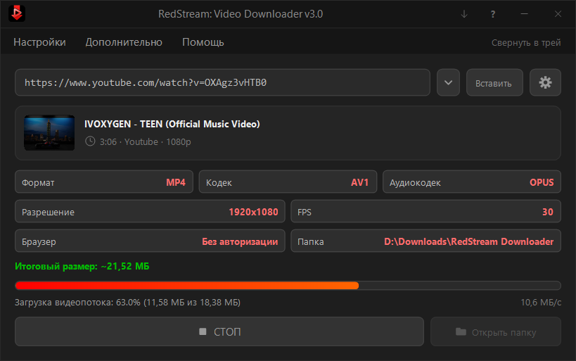

# RedStream: Video Downloader


## 📥 Простой и удобный загрузчик видео с популярных сайтов

**RedStream** — десктопное приложение для Windows с минималистичным интерфейсом, позволяющее скачивать видео и аудио с YouTube, Instagram, TikTok и сотен других платформ. Построено на базе [yt-dlp](https://github.com/yt-dlp/yt-dlp) и [ffmpeg](https://github.com/ffmpeg/ffmpeg).

Начиная с версии **3.0** программа полностью переписана на **C++** (Win32 API + GDI+). Это один нативный `.exe` размером около 2 МБ: без Python, без установки runtime и без внешних библиотек.

---

## ✨ Возможности

- Поддержка YouTube, Instagram, TikTok и [многих других сайтов](https://github.com/yt-dlp/yt-dlp/blob/master/supportedsites.md)
- Скачивание видео в форматах **MKV** и **MP4**
- Скачивание аудио в форматах **OPUS**, **M4A**, **MP3**
- Динамический выбор разрешения, кодека и FPS на основе реальных форматов видео
- Выбор видеокодека: **AV1**, **VP9**, **H.264** и другие (зависит от платформы)
- Умный подбор AV1: если недоступен — автоматически выбирается лучшая альтернатива
- Расчёт итогового размера файла ещё до скачивания
- Обрезка видео по таймкодам прямо при скачивании
- Предпросмотр видео с превью, названием, источником, длительностью и лучшим качеством
- Понятное сообщение об ошибке в карточке предпросмотра, если данные получить не удалось
- История скачанных ссылок
- Авторизация через браузер для видео с возрастными ограничениями
- Автоматическая установка недостающих `7za.exe`, `yt-dlp.exe` и `ffmpeg.exe` при первом запуске
- Автоматическая проверка обновлений программы, yt-dlp и ffmpeg при запуске
- Обновление компонентов внутри приложения
- Прогрессбар с отображением процента, размера, типа потока и скорости загрузки
- Уведомление Windows по завершении скачивания
- Сворачивание в системный трей
- Настройки автозапуска при старте Windows
- Поддержка прокси (HTTP, SOCKS4, SOCKS5) с авторизацией
- **Планировщик загрузок** — запланируйте скачивание на конкретную дату и время
- Заставка при запуске, значок и логотип вшиты в `.exe`

---

## ⚙️ Установка

### Вариант 1 — готовый `.exe` (рекомендуется)

1. Скачать `RedStream.exe` из раздела [Releases](https://github.com/frostbittenbull/RedStream/releases) и запустить его
2. Если рядом с программой нет нужных файлов, при запуске появится окно **«Установка компонентов»** с предложением скачать их автоматически. Файлы скачиваются по очереди:
   1. [`7za.exe`](https://github.com/martinrotter/7za) — распаковщик архивов
   2. [`yt-dlp.exe`](https://github.com/yt-dlp/yt-dlp/releases/latest) — загрузчик видео
   3. [`ffmpeg.exe`](https://www.gyan.dev/ffmpeg/builds/) — обработка видео и аудио (скачивается архивом и распаковывается через `7za.exe`)

> **Требуется:** Windows 10/11 x64 и интернет при первом запуске. Все файлы должны лежать в одной папке с `RedStream.exe`; при желании их можно положить туда вручную.

### Вариант 2 — сборка из исходников

Проект собирается кросс-компилятором **mingw-w64** (на Linux или в MSYS2 на Windows).

```bash
git clone https://github.com/frostbittenbull/RedStream.git
cd RedStream

# Linux (Debian/Ubuntu)
sudo apt install g++-mingw-w64-x86-64-posix

# MSYS2 (Windows): pacman -S mingw-w64-x86_64-gcc

./build.sh
```

В результате появится `RedStream.exe`. Скрипт `build.sh` собирает ресурсы (значок, баннер, логотип, манифест), компилирует исходники из `src/` и статически линкует всё в один файл.

Структура проекта:

| Путь | Назначение |
|------|------------|
| `src/app.cpp` | главное окно, предпросмотр, расчёт размера, скачивание, трей, баннеры, заставка |
| `src/popups.cpp` | меню, «О программе», прокси, планировщик, обновление компонентов, обрезка |
| `src/ui.cpp`, `src/gfx.cpp` | собственные элементы интерфейса и отрисовка на GDI+ |
| `src/util.cpp` | файлы, настройки, запуск процессов, HTTP, реестр |
| `res/` | значок `app.ico`, `banner.png`, `logo.png`, манифест и описание версии |
| `third_party/json.hpp` | [nlohmann/json](https://github.com/nlohmann/json) |

---

## 🖼️ Скриншот



---

## 📁 Куда сохраняются файлы

Все загруженные файлы сохраняются в папку `RedStream Downloader` внутри вашей папки «Загрузки». Папку можно изменить прямо в интерфейсе, нажав на плашку «Папка».

Настройки хранятся рядом с `RedStream.exe`:

| Файл | Содержимое |
|------|------------|
| `settings.txt` | папка для сохранения |
| `proxy.txt` | настройки прокси |
| `history.txt` | история ссылок |
| `log.txt` | журнал yt-dlp и причины ошибок |

---

## ✂️ Обрезка видео

Нажмите кнопку ⚙ рядом с полем ввода ссылки (она активна после загрузки данных о видео). В открывшемся окне укажите таймкоды «Начало» и «Конец» в формате `ЧЧ:ММ:СС`. Если поля оставить пустыми — скачается целиком.

---

## 🕐 Планировщик загрузок

Нажмите **Дополнительно → Планировщик**. В открывшемся окне:

1. Укажите дату и время запуска — вручную или через встроенный календарь
2. Добавьте одну или несколько ссылок
3. Выберите формат, кодек и разрешение
4. Нажмите **ЗАПЛАНИРОВАТЬ**

Планировщик продолжает работать в фоне даже при закрытом окне — таймер и процесс скачивания не прерываются. Повторно открыть окно можно в любой момент, статус восстановится автоматически. Для отмены нажмите **ОТМЕНА**.

---

## 🔄 Автообновление компонентов

При каждом запуске RedStream проверяет наличие обновлений для самой программы, `yt-dlp` и `ffmpeg`. При обнаружении обновления появляется цветной баннер со ссылкой на обновление. Обновить компоненты вручную можно через **Дополнительно → Обновить компоненты** или кнопкой ↓ в заголовке окна.

---

## 🔐 Авторизация через браузер

Для скачивания видео с возрастными ограничениями выберите ваш браузер на плашке «Браузер».

⚠️ **Перед скачиванием браузер должен быть закрыт.**

Если видео не имеет ограничений — выберите «Без авторизации».

---

## 🌐 Прокси

Настройка прокси доступна через **Дополнительно → Настроить прокси**. Поддерживаются протоколы HTTP, SOCKS4 и SOCKS5, а также авторизация по логину и паролю.

---

## 🛠️ Стек технологий

- C++17, Win32 API, GDI+, WinINet
- [mingw-w64](https://www.mingw-w64.org/) — сборка
- [nlohmann/json](https://github.com/nlohmann/json) — разбор данных yt-dlp
- [yt-dlp](https://github.com/yt-dlp/yt-dlp)
- [ffmpeg](https://github.com/ffmpeg/ffmpeg)
- [7-Zip](https://github.com/ip7z/7zip) (`7za.exe`) — распаковка ffmpeg при обновлении
